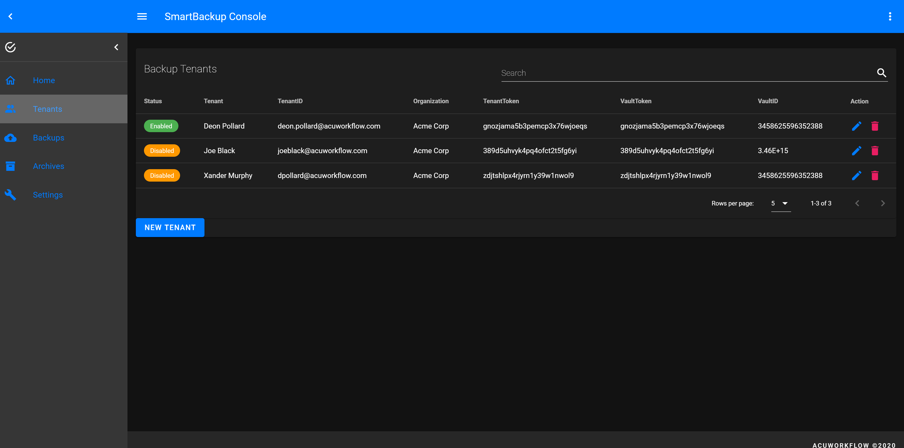
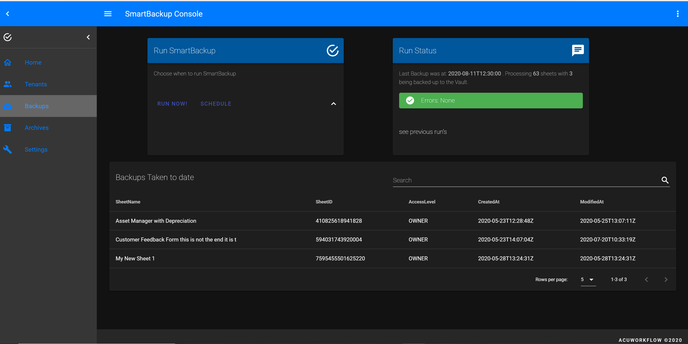

# SmartBackup

[](http://www.acuworkflow.com)

[]() 
  [](https://creativecommons.org/licenses/by-nc-nd/4.0/)

*SmartBackup* is a cloud-enabled backup utility for [Smartsheet](https://www.smartsheet.com).  Backup all your Smartsheet data. 
(c) 2020 AcuWorkflow.

- [x] **Multi-Tenant** solution - can take backups of all, groups-of or any Smartsheet User
-	[x] **Preserve** all Sheet formatting, a feature not available from standard Smartsheet backups
-	[x] Perform **snapshot copy** of all your sheets to a Smartsheet Workspace of your choice
-	[x] **Incremental or full back-ups** with archiving; you have the option to only backup sheets that have changed in last ```x``` days
-	[x] **Export** in addition you can export sheets preserving as much of the smartsheet environmentals as possible
-	[x] Ideal for individuals or teams wanting to snapshot data after certain **events milestones**

> Typically *SmartBackup* is used to provide **rolling window of active sheets** one can re-instate, ideal for when inadvertent changes are made and one needs to roll-back invalid copy

# Easy to Use

-	You can designate any Smartsheet Workspace as Backup Vault
-	On the next backup run, all or a subset of your sheets will be backed-up into the Backup Vault group by backup set Folder
-	Restore is a doddle, you simply copy the Sheet or rows from the Backup Vault area
- [USER GUIDES](https://github.com/deonpollard/smartbackup/wiki/)


# How it works

-	*SmartBackup* can run instantly on demand, on schedule, or at automated intervals
- Optionally you can override the backup set scope (e.g. only backup sheets that have been modified last ```x``` days
-	*SmartBackup* will create a new folder with a timestamp in the user defined SmartSheet Vault designating a backup set
-	For each configured Smartsheet User (Tenant) it backs up all/subset of the sheets owned by that user into the designated Vault and Backup set folder
-	Extensive logging and status are provided
- SmartBackup can be run:
  -- headless(no user interface, available as cmdline routine) and possibly be integrated with your other supporting services or
  -- headfull in which case you access it via a web user interface.

[](http://www.acuworkflow.com/smartbackup.html)


# Getting Started

These instructions will get you up and running with *SmartBackup*.

Steps involved:
  1. **Installation** Install SmartBackup for yourself, team, division, or Organization 
  2. **Setup and Configuration** Configure SmartBackup for your needs
  3. **Using SmartBackup** Schedule or run SmartBackup on demand

## Installation
[INSTALLATION GUIDE](https://github.com/deonpollard/smartbackup/wiki/Installation) 

Install *SmartBackup* on Backup Machine of your choice.  

> The free version is restricted to backing up only 3 sheets.  Contact [AcuWorkflow](http://www.acuworkflow.com) for licensed version with no restrictions.
1. Download from [AcuWorkflow](http://www.acuworkflow.com/smartbackup.html), run SETUP and follow instructions
2. Choose Full Installation when first time User
3. Choose Custom Installation and unselect Data Files if you are re-installing and want to preserve your previous settings


## Setup and Configuration
[SETUP GUIDE](https://github.com/deonpollard/smartbackup/wiki/Setup)

Smartbackup requires you to configure:
1. Smartsheet Users that will make use of SmartBackup, called Tenants
2. Smartsheet Vault, designate a Workspace within Smartsheet tha will be use as the Backup Vault

### Tenants
The Tenants file containing details of Smartbackup users is mandatory and must be supplied. It is installed automatically and you can edit this file via Notepad, or update via the console user interface.
  
Edit the SmartBackup.csv file to contain entries for every Smartsheet User(Tenant) you want to backup. Note column names must be spelled exactly as shown and are case-sensitive.

| Name | Description | Example |
| --- | --- | --- |
| Status | Must be set to **'Enabled'** for processing tenant entry. To disable an entry on backup run change to the Status value to **‘Disabled’** | Enabled |
| Tenant | Name of Tenant  | Joe Blocks |
| TenantID | Email address of Tenant |  joe.blocks@acme.com |
| TenantOrg | Organization Name of Tenant | Acme Corp |
| TenantToken | Smartsheet **API Token** of Tenant (Backup Source) | ute0kvn9ol6lq10jwjylky9kdp |
| VaultID | Smartsheet **Workspace ID** of Workspace where designated Vault resides. Be carefull when editing this with Excel, since it will by default transform to exponential number, rather use Notepad or the built-in UI for editing | 3458625596352300 |
| VaultLink | Smartsheet **Workspace Link** of Workspace where designated Vault resides | ``https://app.smartsheet.com/workspaces...`` |

- You can have multiple Tenant Files each containing differing configurations based on your setup
- At run time associate the Tenant file you want to use for that particular run
- To get TenantToken 
   - Login to Smartsheet, click on Account top right
   - Select Apps & Integrations, then API, Generate Token
   - **Token** becomes your **TenantToken** in tenantfile, that way the backup knows who you are and therefore what files to backup

### Backup Vault
Once-off configure a Smartsheet Workspace that will act as the backup container.  To do this:
1. Login to Smartsheet, select **Workspaces**, right-click and then select [Create new Workspace](https://www.smartsheet.com)
2. Name the Workspace aptly, such as ``Vault`` or ``Backup Vault`` or ``SmartBackup Vault``
3. Right-click on Vault Workspace and select **Properties**
4. Copy the **Workspace ID** to tenantfile **VaultID**, in so doing it becomes the designated Target Backup area
5. Copy the **Workspace Link** to tenantfile **VaultLink**

> Note, Smartsheet restricts the number of sheets allowed for non-Enterprise [licenses](https://www.smartsheet.com/pricing).  Usually it is 100 per User or aggregate thereof e.g. 10 Users = 1000 Sheets.  In the event that you are running into these restrictions decrease the backup scope.

# Using SmartBackup 
[USER GUIDE](https://github.com/deonpollard/smartbackup/wiki/Usingit)

1. Invoke SmartBackup by clicking on desktop shortcut or double-click on console.exe in \apps installation folder
2. A cmd Window will appear running the Console Server with slight delay and then a browser view will be opened running the console client

[]()

## First Time Users
1.  You will be prompted to configure some valid Tenant/s (at least one) by completeing some details
2.  To understand details required see Setup & Configuration Tenants file
3.  You also MUST setup a Backup Vault within Smartsheet see Setup & Configuration Vault

[]()

## Your first Backup run
1. Click on Run Now
2. After slight delay a Backup Run started popup will appear. 
3. Optionally you can view progress by switching to console server window, alternatively status will be displayed after the backup run is completed

[]()


# Authors

* **Deon Pollard** - *Base software* - [deon pollard & associates](https://www.deonpollard.com)

> See also list of [contributors](http://www.acuworkflow.com) who participated in this project.

# License

[](https://creativecommons.org/about/cclicenses/)
This project is licensed under the Creative Commons License -  [LICENSE](https://creativecommons.org/about/cclicenses/) for details 
