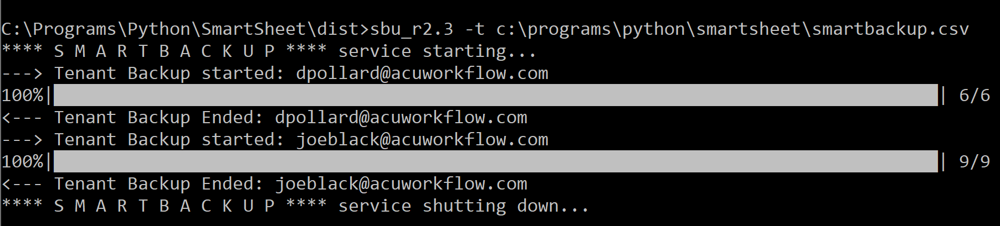

# SmartBackup

[](http://www.acuworkflow.com)

[]() [![PyPI pyversions]


*SmartBackup* is a cloud-enabled backup utility for [Smartsheet](https://www.smartsheet.com).  Backup all your Smartsheet data. 
(c) 2020 AcuWorkflow.

- [x] **Multi-Tenant** solution - can take backups of all, groups-of or any Smartsheet User
-	[x] **Preserve** all Sheet formatting, a feature not available from standard Smartsheet backups
-	[x] Perform **snapshot copy** of all your sheets to a Smartsheet Workspace of your choice
-	[x] **Incremental or full back-ups** you have the option to only backup sheets that have changed in last ```x``` days
-	[x] Ideal for individuals or teams wanting to snapshot data after certain **events milestones**

> Typically *SmartBackup* is used to provide **rolling window of active sheets** one can re-instate, ideal for when inadvertent changes are made and one needs to roll-back invalid copy

# Easy to Use

-	You can designate any Smartsheet Workspace as Backup Vault
-	On the next backup run, all or a subset of your sheets will be backed-up into the Backup Vault group by backup set Folder
-	Restore is a doddle, you simply copy the Sheet or rows from the Backup Vault area


# How it works

-	*SmartBackup* can run instantly on demand, on schedule, or at automated intervals
- Optionally you can override the backup set scope (e.g. only backup sheets that have been modified last ```x``` days
-	*SmartBackup* will create a new folder with a timestamp in the user defined SmartSheet Vault designating a backup set
-	For each configured Smartsheet User (Tenant) it backs up all/subset of the sheets owned by that user into the designated Vault and Backup set folder
-	Extensive logging and status are provided

[](http://www.acuworkflow.com)

# Getting Started

These instructions will get you up and running with *SmartBackup*.

Steps involved:
  1. **Installation** Install SmartBackup for yourself, team, division, or Organization
  2. **Setup and Configuration** Configure SmartBackup for your needs
  3. **Run SmartBackup** Schedule SmartBackup to run  

## Installation

*SmartBackup* for Windows requires an EXE to run.

Install *SmartBackup* on Backup Machine of your choice.

```sh
$ mk smartbackup
$ cd smartbackup
$ xcopy <source> smartbackup
```

## Setup and Configuration

### Tenants file
The Tenants file is  mandatory and must be supplied.  Edit the SmartBackup.csv file to contain entries for every Smartsheet User(Tenant) you want to backup. Note column names must be spelled exactly as shown and are case-sensitive.

| Name | Value |
| ------ | ------ |
| Status | Must be set to **'Enabled'** for processing tenant entry. To disable an entry on backup run change to the Status value to **‘Disabled’** |
| Tenant | Name of Tenant e.g. **Joe Blocks** |
| TenantID | Email address of Tenant e.g. **joe.blocks@acme.com** |
| TenantOrg | Organization Name of Tenant e.g. **Acme Corp** |
| TenantToken | Smartsheet **API Token** of Tenant (Backup Source) |
| VaultToken | Smartsheet **API Token** of Vault Tenant (Backup Target). Should be the same if Tenant is backing up to a Workspace within his/her environment |
| VaultID | Smartsheet **Workspace ID** of Workspace where designated Vault resides |
| VaultLink | Smartsheet **Workspace Link** of Workspace where designated Vault resides |

- You can have multiple Tenant Files each containing differing configurations based on your setup
- At run time associate the Tenant file you want to use for that particular run
- To get TenantToken 
   - Login to Smartsheet, click on Account top right
   - Select Apps & Integrations, then API, Generate Token
   - **Token** becomes your **TenantToken** in tenantfile, that way the backup knows who you are and therefore what files to backup

> [Good guide to get token ](https://help.meisterplan.com/hc/en-us/articles/115003776834-Creating-an-API-Access-Token-for-Smartsheet)

### Backup Vault
Once-off configure a Smartsheet Workspace that will act as the backup container.  To do this:
1. Login to Smartsheet, select **Workspaces**, right-click and then select [Create new Workspace](https://www.smartsheet.com)
2. Name the Workspace aptly, such as ``Vault`` or ``Backup Vault`` or ``SmartBackup Vault``
3. Right-click on Vault Workspace and select **Properties**
4. Copy the **Workspace ID** to tenantfile **VaultID**, in so doing it becomes the designated Target Backup area
5. Copy the **Workspace Link** to tenantfile **VaultLink**


### Run SmartBackup
- SmartBackup ```R2.3``` is only available for Windows environments 
- MacOS and Linux Versions will shortly be released 
- When invoked from cmdline status and progress for each tenant will be shown as indicated below

[](http://www.acuworkflow.com)

#### Optional Arguments
The following parameters can optionally be passed as arguments on cmdline invocation

``-t or --tenantfile path\smartbackup.csv`` Path and filename of *TenantsFile*.  If not supplied will default to SmartBackup.csv in current execution folder.  Smartbackup will terminate if file not found.

``-l or --logfile path\smartbackup.csv`` Path and filename of *LogFile*.  If not supplied will default to SmartBackup.log in current execution folder.  If not found will attempt to create one in current execution folder.  Smartbackup will terminate if it cannot be created.

``-d or --days 7`` Incremental backup.  Example shown, only backup sheets modified in last 7 days.  Backup all files modified in **days** period.  Default is 3 days.  To turn incremental backup into full backup typically do ``-d 9999``


#### Run from Windows CMDLine
Invoke Cmdline by clicking on Windows search and type ``cmd``
then invoke as follows:

> ``sbu_r2.3.exe``  
> ``sbu_r2.3.exe -t c:\smartbackup\tenants\tenants.csv``

#### Run from Windows Shortcut
Create shortcut pointing to EXE and click on shortcut

#### Run from Windows Explorer
Double click on EXE.  Note this method does not easily allow you to specify arguments

#### Run from Windows Task Scheduler
Open Windows Task Scheduler and configure EXE to a schedule of your choice

#### Run using PowerShell
Script EXE using Powershell

# Authors

* **Deon Pollard** - *Base software R2.3* - [deon pollard & associates](https://deonpollard.com)

> See also list of [contributors](http://www.acusoftware.com) who participated in this project.

# Planned Changes
The following enhancements are planned

- Direct Archiving Option
- Indirect Archiving Option - Ability to automatically roll-off and archive sheets from Vault into Archive
- Improved Reporting, Backup Catalog and Maps

# License

[](https://creativecommons.org/about/cclicenses/)
This project is licensed under the Creative Commons License -  [LICENSE](https://creativecommons.org/about/cclicenses/) for details 
